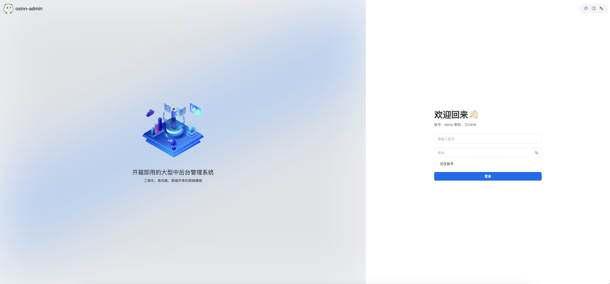
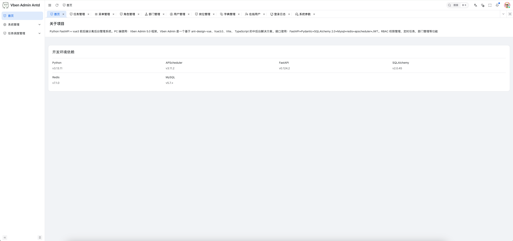
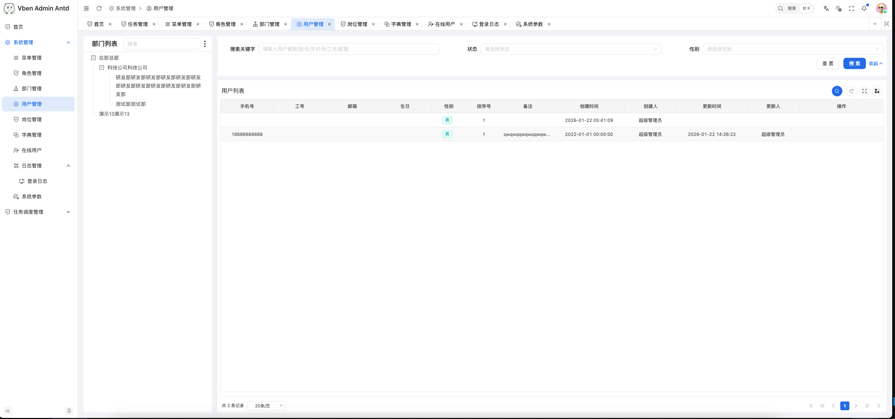
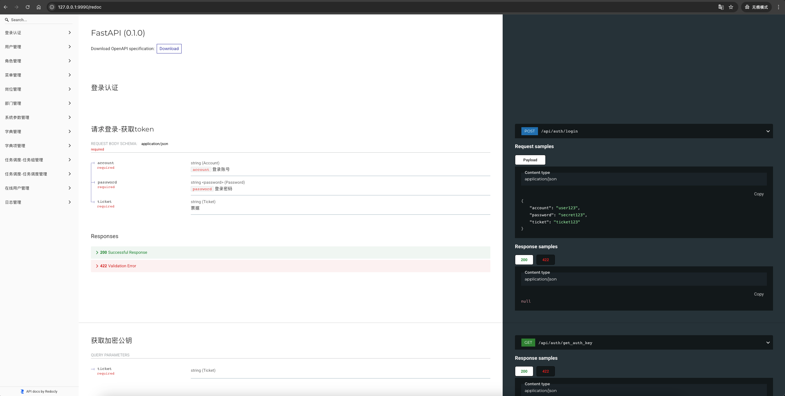
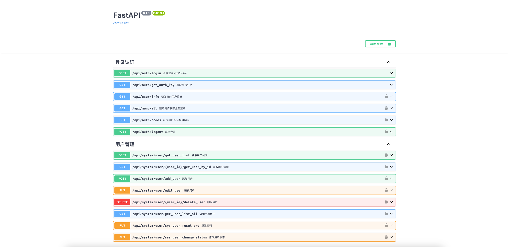

# python-admin-vben
python-admin-vben 后台管理系统，使用Python v3.13、FastAPI v0.124.2 基于 vue-vben-admin 5.0 版本，vue3 vite6 ant-design-vue typescript 语法开发高性能后台管理系统

- [前端项目](https://github.com/osinn/python-vue-vben-admin) - vue-vben-admin

# 安装依赖
- 执行`pip3 install -r requirements.txt -i https://pypi.tuna.tsinghua.edu.cn/simple`
- 执行`pip3 freeze > requirements.txt`命令将项目依赖添加到`requirements.txt`中

# 接口文档
- http://127.0.0.1:9990/docs 或 http://127.0.0.1:9990/redoc

# 项目结构
```
python-admin-vben/
├── apps/                               # 业务应用核心
│   ├── generator/                      # 简陋的model代码生成器模块
│   ├── modules/                        # 业务模块集合
│   │   ├── sys/                        # 系统基础模块
│   │   │   ├── basis/                  # 系统基础功能
│   │   │   │   ├── crud/               # CURD 操作封装
│   │   │   │   ├── models/             # 数据库模型定义
│   │   │   │   ├── params/             # 请求参数校验模型
│   │   │   │   ├── routers/            # 接口路由定义
│   │   │   │   │   └── __init__.py     # 当前接口路由定义导入
│   │   │   │   ├── schemas/            # 数据传输模型
│   │   │   ├── monitor/                # 系统监控模块
│   │   │   ├── scheduler/              # 定时任务模块
│   └── app_router.py                   # 应用模块路由总入口
├── config/                             # 配置中心
│   ├── .env                            # 环境变量配置
│   ├── .env.dev                        # 开发环境变量配置
│   ├── .env.docker                     # docker环境变量配置
│   ├── .env.prod                       # 生产环境变量配置
│   └── settings.py                     # 系统配置
├── core/                               # 核心框架
│   ├── common/                         # 通用业务逻辑
│   ├── constants/                      # 全局常量
│   ├── framework/                      # 框架扩展（中间件、认证等）
│   ├── utils/                          # 工具函数库
├── lib/                                # 第三方依赖库
├── main.py                             # 项目启动入口
└── requirements.txt                    # Python 依赖声明
```

# sqlalchemy 参数速查表
| 参数 | 类型 | 说明 | 示例 |
|------|------|------|------|
| `primary_key` | bool | 是否主键 | `primary_key=True` |
| `nullable` | bool | 是否允许NULL | `nullable=False` |
| `unique` | bool | 是否唯一 | `unique=True` |
| `index` | bool | 是否创建索引 | `index=True` |
| `default` | 任意 | Python默认值 | `default=0` |
| `server_default` | 字符串 | 数据库默认值 | `server_default='active'` |
| `onupdate` | 函数 | 更新时调用的函数 | `onupdate=datetime.utcnow` |
| `autoincrement` | bool/str | 自动增长 | `autoincrement=True` |
| `doc` | str | 文档字符串 | `doc='用户邮箱地址'` |
| `comment` | str | 列注释 | `comment='创建时间'` |
| `key` | str | Python属性名 | `key='user_name'` |
| `system` | bool | 是否为系统列 | `system=False` |

# Linux 部署项目
```
- 进入项目根目录
- 创建虚拟环境 python3 -m venv .venv
- 激活虚拟环境 source .venv/bin/activate
- 安装依赖 pip3 install -r requirements.txt

- 如果安装依赖提示 WARNING: Running pip as the 'root' user can result in broken permissions and conflicting behaviour with the system package manager, possibly rendering your system unusable. It is recommended to use a virtual environment instead: https://pip.pypa.io/warnings/venv. Use the --root-user-action option if you know what you are doing and want to suppress this warning
- 可以使用虚拟环境下的pip进行安装 ./.venv/bin/pip install -r requirements.txt，或者不使用root用户改用普通用户进行安装
```
### 创建 Systemd 服务文件
- fastapi.service

```
[Unit]
Description=fastapi service
After=network.target

[Service]
Type=simple
WorkingDirectory=/home/project/python-admin-vben
# 生产环境关键配置
Environment="DEBUG=False"

ExecStart=/home/project/python-admin-vben/.venv/bin/python main.py

Restart=always

RestartSec=5
KillSignal=SIGINT
SyslogIdentifier=fastapi-identifier
User=root

[Install]
WantedBy=multi-user.target
```
### 启动服务
```
systemctl daemon-reload
systemctl start fastapi
systemctl status fastapi
```








